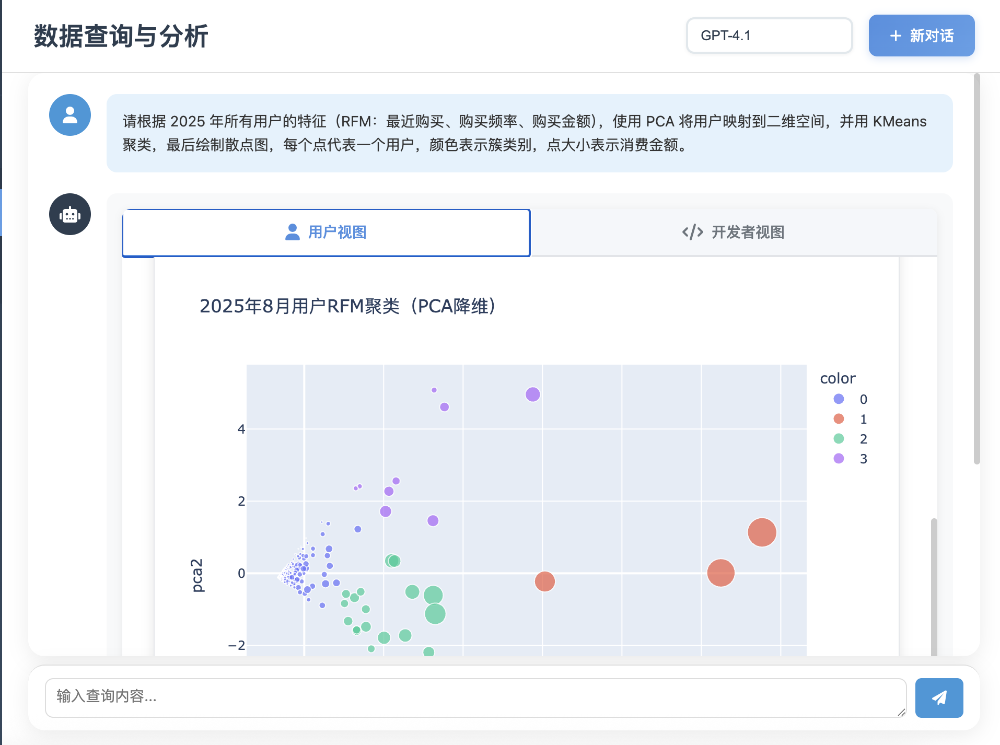
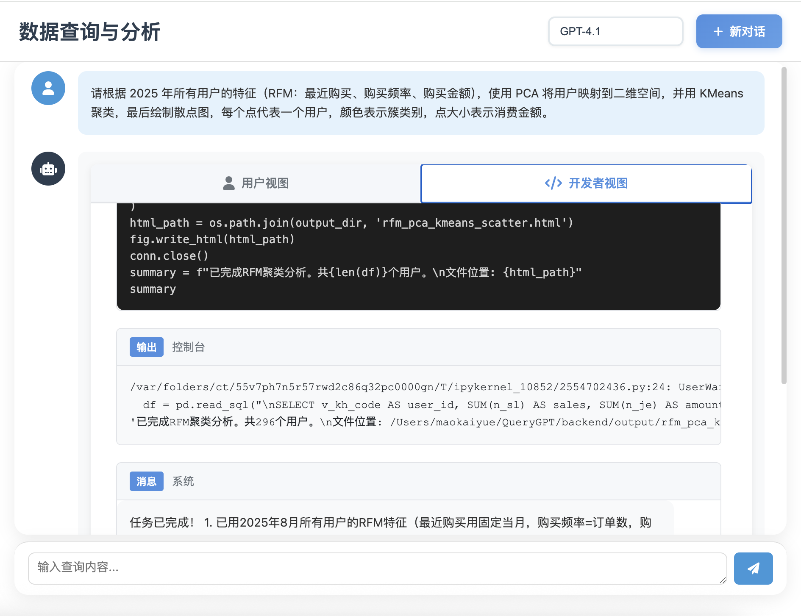

<div align="center">
  
  
  
  <br/>
  
  <p>
    <a href="#">简体中文</a> •
    <a href="docs/README_EN.md">English</a> •
    <a href="docs/README/README_ZH-TW.md">繁體中文</a> •
    <a href="docs/README/README_JA.md">日本語</a> •
    <a href="docs/README/README_ES.md">Español</a> •
    <a href="docs/README/README_FR.md">Français</a> •
    <a href="docs/README/README_DE.md">Deutsch</a> •
    <a href="docs/README/README_RU.md">Русский</a> •
    <a href="docs/README/README_PT.md">Português</a> •
    <a href="docs/README/README_KO.md">한국어</a>
  </p>
  
  <br/>
  
  [](LICENSE)
  [](https://www.python.org/)
  [](https://github.com/OpenInterpreter/open-interpreter)
  [](https://github.com/MKY508/QueryGPT/stargazers)
  
<p>
  <a href="https://render.com/deploy?repo=https://github.com/MKY508/QueryGPT">
    
  </a>
</p>
  
</div>


<br/>

---

## ✨ 核心优势

**智能 Agent 全自动分析**
- **自主探索**：遇到问题会主动查看表结构、样本数据，无需强数据治理和语义层
- **多轮验证**：发现异常会自动重新检查，自动pip下载需要的额外的库，确保结果准确可靠
- **复杂分析**：不只是 SQL，能执行 Python 做统计分析、机器学习、数据可视化
- **推理可见**：展示 Agent 的分析过程，让AI决策透明化
- **企业可用**：只读权限操作，数据库连接符合绝大多数企业的要求，简单配置，满足大火的chatbi要求

## 📸 系统截图

<table>
  <tr>
    <td align="center">
      
      <b>AI 思考进程</b>
    </td>
  </tr>
  <tr>
    <td align="center">
      
      <b>交互式数据可视化展示</b>
    </td>
  </tr>
  <tr>
    <td align="center">
      
      <b>透明代码执行</b>
    </td>
  </tr>
</table>

## 🌟 功能特性

### 智能路由系统
- **AI 查询分类**: 使用 LLM 智能判断查询意图，自动选择最优执行路径
- **2种执行模式**:
  - `QA`: 闲聊或非数据库请求，礼貌拒绝
  - `ANALYSIS`: 数据取数与分析统一入口，可执行 Python、绘图与总结
- **安全兜底**: 数据库不可用或分类失败时提供显式提醒与 fallback
- **灵活配置**: 每种模式独立 Prompt，可在前端可视化配置/导入导出
- **数据库守卫**: 查询前自动进行轻量连通性检测，Failure 时给予提示并允许用户决定是否继续
- **步骤播报**: 可配置的 Step Narration 模块，统一输出 `步骤{index}：{summary}` 样式，让执行过程透明可见

### Agent 核心能力
- **自主数据探索**: Agent 会主动了解数据结构、探索数据关系
- **多轮推理迭代**: 像分析师一样，发现问题会深入调查
- **Chain-of-Thought**: 展示 Agent 思考过程，可再次提问介入纠正
- **上下文记忆**: 理解对话历史，支持连续多轮分析

### 数据分析能力
- **SQL + Python**: 不局限于 SQL，能执行复杂 Python 数据处理，以保证数据可靠性
- **统计分析**: 可进行相关性分析、趋势预测、数据异常检测
- **中文业务术语**: 原生理解环比、同比、留存、复购等概念
- **智能可视化**: 根据数据特征自动选择最佳图表类型(可指定)

### 系统特性
- **新手引导系统**: 交互式气泡提示，帮助新用户快速上手
- **多模型支持**: GPT-5、Claude、Gemini、Ollama 本地模型随意切换
- **灵活部署**: 支持云端 API 或 Ollama 本地部署，数据可不出门，符合合规要求
- **历史记录**: 保存分析过程，支持回溯和分享
- **数据安全**: 只读权限prompt、SQL 注入正则防护、敏感数据脱敏，确保万无一失
- **灵活导出**: 支持 Excel、PDF、HTML 等多种格式
- **Prompt 自定义**: 前端可视化编辑查询提示词，自定义要求

## 📦 环境要求

- Python 3.10.x（必需，OpenInterpreter 0.4.3 依赖）
- MySQL 协议兼容的数据库（详见下方支持列表）
- 支持系统：Linux、macOS、**Windows (原生支持 + WSL)**

> ✅ **Windows用户**：现在支持两种方式运行：
> - **原生 Windows**：直接双击 `setup.bat` 和 `start.bat`（推荐）
> - **WSL**：使用 `setup.sh` 和 `start.sh`（功能完全相同）

<br/>

## 📊 产品对比

| 对比维度 | **QueryGPT** | Vanna AI | DB-GPT | TableGPT | Text2SQL.AI |
|---------|:------------:|:--------:|:------:|:--------:|:-----------:|
| **费用** | **✅ 免费** | ⭕ 有付费版 | ✅ 免费 | ❌ 收费 | ❌ 收费 |
| **开源** | **✅** | ✅ | ✅ | ❌ | ❌ |
| **本地部署** | **✅** | ✅ | ✅ | ❌ | ❌ |
| **执行 Python 代码** | **✅ 完整环境** | ❌ | ❌ | ❌ | ❌ |
| **可视化能力** | **✅ 可编程** | ⭕ 预设图表 | ✅ 丰富图表 | ✅ 丰富图表 | ⭕ 基础 |
| **中文业务理解** | **✅ 原生** | ⭕ 基础 | ✅ 良好 | ✅ 优秀 | ⭕ 基础 |
| **Agent 自主探索** | **✅** | ❌ | ⭕ 基础 | ⭕ 基础 | ❌ |
| **实时思考展示** | **✅** | ❌ | ❌ | ❌ | ❌ |
| **扩展能力** | **✅ 无限扩展** | ❌ | ❌ | ❌ | ❌ |

## 🚀 快速开始

### ☁️ 一键部署（Render）

<p>
  <a href="https://render.com/deploy?repo=https://github.com/MKY508/QueryGPT">
    
  </a>
</p>

1. 点击上方「一键部署」按钮并登录 Render（首次需要授权访问 GitHub）。
2. 保持默认 `Free` 方案，点击 **Deploy QueryGPT** 开始构建。
3. 构建完成后，在 Render 控制台点击服务访问链接（形如 `https://xxxx.onrender.com`，示例：`https://querygpt-sjje.onrender.com`）即可打开应用。
4. 首次部署会经历 Render 约 90 秒的冷启动，加上应用初始化通常 3-10 分钟，请耐心等待页面加载完成。
5. 首次进入后，在左侧边栏的 **设置** 中补充自己的模型 API（`API_KEY`/`API_BASE_URL`）和数据库连接信息，即可与真实服务联通。

> ℹ️ 线上 Demo 默认使用内置示例配置，可浏览 UI、历史记录等功能。配置完成后即可启用完整的 AI 分析能力。

### 极简安装

#### 🍎 macOS / Linux 用户
```bash
# 1. 克隆项目
git clone https://github.com/MKY508/QueryGPT.git
cd QueryGPT

# 2. 运行脚本
chmod +x setup.sh start.sh
./setup.sh   # 自动安装所有依赖（2-5分钟）
./start.sh   # 启动服务
```

就这么简单！✨ 

#### 🪟 Windows 用户（原生支持）
```cmd
# 1. 克隆项目（在 PowerShell 或 CMD 中）
git clone https://github.com/MKY508/QueryGPT.git
cd QueryGPT

# 2. 运行脚本
setup.bat   # 自动安装所有依赖（2-5分钟）
start.bat   # 启动服务
```

> 💡 **提示**：Windows 下会使用 `venv_py310\Scripts\` 作为虚拟环境目录，与 Linux/macOS 的 `venv_py310/bin/` 完全兼容。

#### 🐧 Windows WSL 用户
```bash
# 步骤1：进入WSL（在PowerShell中）
wsl

# 步骤2：克隆项目（在WSL中）
cd ~
git clone https://github.com/MKY508/QueryGPT.git
cd QueryGPT

# 步骤3：运行脚本（在WSL中）
./setup.sh   # 自动处理所有依赖
./start.sh   # 启动服务
```

### 访问服务
自动打开浏览器访问：`http://localhost:500x`

## 💡 使用示例

### 基础查询 
- "显示最近一个月的销售数据"
- "分析产品类别的销售占比"
- "查找销售额最高的前10个客户"

### 高级分析
- "对比今年和去年同期的销售增长"
- "预测下个季度的销售趋势"
- "找出异常的订单数据"
- "分析客户购买行为模式"

### 复杂任务(时间长,注意token花费,可能需要多步进行)
- "生成月度销售报告，包含环比、同比和趋势图"
- "分析客户流失原因并给出建议"
- "构建 RFM 客户分层模型"

## 🔧 配置说明

### 支持的模型(原生openai格式的api最好)
- **OpenAI**: GPT-5, GPT-4.1(经济)
- **Anthropic**: Claude 4 Opus, Sonnet(评分最高,最智能的模型,**推荐**)
- **Google**: Gemini 2.5pro(litellm可能兼容性有点问题)
- **国产模型**: Qwen、DeepSeek、GLM-4、百川等
- **本地模型**: 通过 Ollama 支持 Llama, Mistral, Qwen 等（推荐 qwen2.5 7b以上，确保代码能力）
- **推荐选择**: Claude 4系列、GPT-4、DeepSeek V3等强大的基础模型，确保Agent执行成功率

### 数据库支持

系统使用标准 MySQL 协议，支持以下数据库：

#### ✅ 完全兼容
- **Apache Doris** / **StarRocks** - OLAP 分析型数据库（推荐用于大数据分析）
- **MySQL 5.7+** / **MariaDB 10.3+** - 传统关系型数据库
- **TiDB** - 分布式 NewSQL 数据库
- **OceanBase** - 分布式数据库（MySQL 模式）
- **PolarDB** - 阿里云原生数据库

- 支持跨库查询（配置时不指定数据库名即可）


## 🔧 快速故障排除

### Windows 常见问题

| 问题 | 解决方案 |
|------|---------|
| **'python' 不是内部或外部命令** | 请安装 Python 3.10 并添加到系统 PATH，或使用 `py -3.10` 运行 |
| **setup.bat 执行失败** | 确保已安装 Python 3.10，运行 `python --version` 检查版本 |
| **虚拟环境创建失败** | 运行 `python -m venv venv_py310` 手动创建，或检查 Python 安装是否完整 |
| **start.bat 找不到虚拟环境** | 确保已运行 `setup.bat` 完成初始化 |
| **端口被占用** | 脚本会自动查找可用端口（5000-5100），或设置环境变量 `set PORT=8080` |

### Windows WSL 常见问题

| 问题 | 解决方案 |
|------|---------|
| **bash: ./setup.sh: No such file or directory** | 您在PowerShell中，请先输入 `wsl` 进入WSL环境，或使用 `setup.bat` |
| **'.' 不是内部或外部命令** | 在 WSL 中使用 `./setup.sh`，或在 Windows 中使用 `setup.bat` |
| **Permission denied** | 运行 `chmod +x setup.sh start.sh` 添加执行权限 |
| **WSL中进程立即停止** | 脚本已自动处理，使用前台运行模式 |
| **模块库确实** | 没有进入python虚拟环境(一般来说脚本会自动进入,但是有些系统受兼容性影响虚拟环境有问题,可以尝试自己创建) |

### Linux/Ubuntu 常见问题

| 问题 | 解决方案 |
|------|---------|
| **No module named 'venv'** | 运行 `sudo apt install python3-venv` 或使用setup.sh自动修复 |
| **pip安装超时** | 脚本setup会自动配置国内镜像源（阿里云/清华/中科大） |
| **virtualenv: command not found** | 运行 `pip install virtualenv` |

### 通用问题

| 问题 | 解决方案 |
|------|---------|
| **找不到backend目录** | 运行 `cd ~/QueryGPT-github && ./start.sh` |
| **环境检测问题** | 运行 `./scripts/diagnostics/diagnostic.sh` 查看详细环境信息,反馈邮箱 |

## 最新更新
### 2025-11-04 - v1.5 智能路由与 UX 全面重构
- **路由简化**: 移除 SQL_ONLY 路径，统一为 QA（简单问候与处理）与 ANALYSIS（数据分析）双路由模式，简化执行流程
- **Prompt 深度优化**: 
  - 重写 ANALYSIS 系统提示为五阶段完整流程（连接→探索→表选择→数据处理→输出），内嵌数据库探索策略
  - 同步设置页、prompt_config.json、setup.sh 等多处配置，确保前后端一致
- **数据库守卫增强**: 
  - 连接失败时弹窗复用思考气泡、不新增对话消息，避免视觉跳跃
  - 新ui：警告卡片样式优化，展示连接目标、检测时间与建议步骤
- **思考过程可视化**: 
  - 后端自动提取 `[步骤 x]` 播报并返回步骤数组，前端逐条播放动画，实现 ChatGPT 风格的实时思考展示
  - 用户视图自动过滤步骤前缀，保持总结简洁；开发者视图保留完整日志
  - 精简初始占位阶段，仅保留"理解需求"，真实步骤到来时平滑追加
- **设置页修复**: 修正标签切换逻辑，确保模型管理、数据库配置、Prompt 设置等子页面可正常切换

### 2025-09-24 - 小版本修改
- **支持更多api类型**: 国内外和本地多api
- **速度提升**: 异步处理,后端加速进行,删除不必要的检测
- **停止按钮优化**: 可以不妨碍历史记录生成
- **新建模型处理**: 可以支持使用更多的模型
- **人性化处理**: 一些默认配置更符合用户使用
- **历史记录优化**: 过滤掉没有实际意义的打断的查询对话

### 2025-09-05 - v1.2 正式版本发布
- **虚拟环境智能创建**: 解决Ubuntu/Debian缺少python3-venv问题
- **三层回退机制**: venv → 自动安装python3-venv → virtualenv备选
- **Windows WSL文档**: 增强README说明，明确必须在WSL中运行
- **环境检测优化**: 修复macOS和纯Linux环境检测问题
- **诊断工具新增**: 添加diagnostic.sh用于环境问题排查
- **代码深度清理**: 删除45KB无用代码，提升项目可维护性
- **启动速度优化**: 移除首次进入模型页的自动批量测试，减少无必要请求并避免状态误写，缩短首屏加载时间


### 2025-08-28 - 新手引导系统
- **交互式引导**: 首次访问自动展示系统功能，气泡提示引导操作
- **智能定位**: 自动检测元素位置，确保气泡准确指向目标
- **灵活配置**: 通过配置文件控制引导行为，可轻松禁用
- **进度跟踪**: 显示引导进度，支持前进、后退、跳过操作
- **用户友好**: 历史记录优化，移除冗余模型显示，修复对话计数

> 配置文件: `config/onboarding_config.json` - 设置 `enabled: false` 可禁用引导

### 2025-08-24 - Prompt 自定义功能
- **可视化编辑**: 在设置页面直接编辑 AI 查询提示词
- **配置管理**: 支持保存、恢复默认、导入导出配置
- **灵活定制**: 根据业务需求调整探索策略、表选择规则、字段映射等
- **多语言支持**: 完整的中英文 i18n 支持
- **实时生效**: 修改后立即应用到查询过程

## 🤝 贡献

欢迎提交 Issue 和 Pull Request！

## 📄 许可证

MIT License - 详见 [LICENSE](LICENSE)

## 🙏 致谢

- [OpenInterpreter](https://github.com/OpenInterpreter/open-interpreter) - 核心 AI 引擎
- [Flask](https://flask.palletsprojects.com/) - Web 框架
- [Plotly](https://plotly.com/) - 数据可视化

## 📧 联系方式

- GitHub Issues: [提交问题](https://github.com/MKY508/QueryGPT/issues) 
- Email: mky369258@gmail.com
- 这是作者第一个项目作品,有任何疑问或者可能需要的改动,都可以提交issue或者pr,我会尽可能进行调整
- 如果觉得有用，请给个 ⭐ Star 支持一下！这对作者的研究生复试很重要(也许)
## ⭐ Star History

<div align="center">
  <a href="https://star-history.com/#MKY508/QueryGPT&Date">
    <picture>
      <source media="(prefers-color-scheme: dark)" srcset="https://api.star-history.com/svg?repos=MKY508/QueryGPT&type=Date&theme=dark" />
      <source media="(prefers-color-scheme: light)" srcset="https://api.star-history.com/svg?repos=MKY508/QueryGPT&type=Date" />
      
    </picture>
  </a>
</div>

---

<div align="center">
  <sub>如果觉得有用，请给个 ⭐ Star 支持一下！</sub>
</div>
