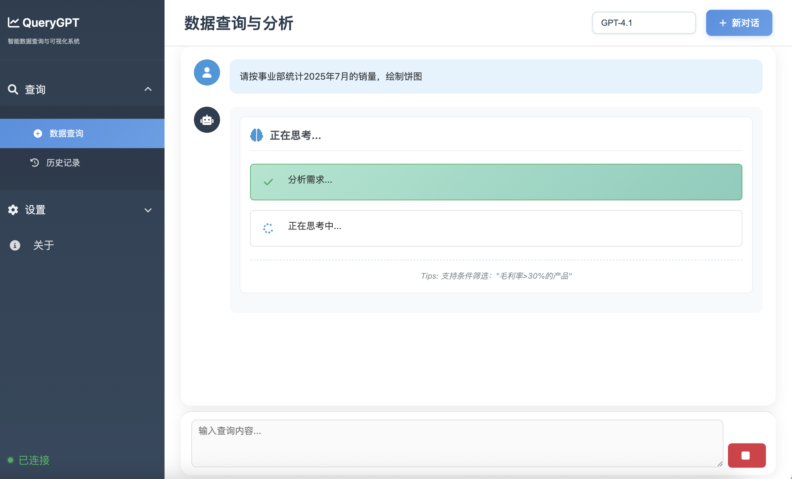

<div align="center">
  
  
  
  <br/>
  
  <p>
    <a href="#">简体中文</a> •
    <a href="docs/README_EN.md">English</a> •
    <a href="docs/README/README_ZH-TW.md">繁體中文</a> •
    <a href="docs/README/README_JA.md">日本語</a> •
    <a href="docs/README/README_ES.md">Español</a> •
    <a href="docs/README/README_FR.md">Français</a> •
    <a href="docs/README/README_DE.md">Deutsch</a> •
    <a href="docs/README/README_RU.md">Русский</a> •
    <a href="docs/README/README_PT.md">Português</a> •
    <a href="docs/README/README_KO.md">한국어</a>
  </p>
  
  <br/>
  
  [](LICENSE)
  [](https://www.python.org/)
  [](https://github.com/OpenInterpreter/open-interpreter)
  [](https://github.com/MKY508/QueryGPT/stargazers)
  
  <br/>
  
  <h3>基于 OpenInterpreter 的智能数据分析 Agent</h3>
  <p><i>用自然语言与数据库对话</i></p>
  
</div>

> 🪟 **Windows 用户提醒**：本项目必须在 **WSL (Windows Subsystem for Linux)** 中运行，不支持PowerShell或CMD。请查看[安装说明](#-windows-用户必读)。

<br/>

---

## ✨ 核心优势

**智能 Agent 全自动分析**
- **自主探索**：遇到问题会主动查看表结构、样本数据，无需人工干预
- **多轮验证**：发现异常会自动重新检查，确保结果准确可靠
- **复杂分析**：不只是 SQL，能执行 Python 做统计分析、机器学习、数据可视化
- **推理可见**：实时展示 Agent 的分析过程，让AI决策透明化

## 📸 系统截图

<table>
  <tr>
    <td align="center">
      
      <b>实时 AI 思考过程</b>
    </td>
  </tr>
  <tr>
    <td align="center">
      
      <b>交互式数据可视化</b>
    </td>
  </tr>
  <tr>
    <td align="center">
      
      <b>透明代码执行</b>
    </td>
  </tr>
</table>

## 🌟 功能特性

### 智能路由系统 🆕
- **AI 查询分类**: 使用 LLM 智能判断查询意图，自动选择最优执行路径
- **四种执行模式**:
  - `DIRECT_SQL`: 简单查询直接转 SQL，毫秒级响应
  - `SIMPLE_ANALYSIS`: SQL + 轻量数据处理，秒级完成
  - `COMPLEX_ANALYSIS`: 完整 Agent 流程，深度分析
  - `VISUALIZATION`: 自动生成交互式图表
- **性能提升**: 简单查询响应速度提升 80%+，复杂查询保持原有能力
- **灵活配置**: 每种模式独立 Prompt，可根据业务需求精准调优

### Agent 核心能力
- **自主数据探索**: Agent 会主动了解数据结构、探索数据关系
- **多轮推理迭代**: 像分析师一样，发现问题会深入调查
- **Chain-of-Thought**: 实时展示 Agent 思考过程，可随时介入纠正
- **上下文记忆**: 理解对话历史，支持连续多轮分析

### 数据分析能力
- **SQL + Python**: 不局限于 SQL，能执行复杂 Python 数据处理
- **统计分析**: 自动进行相关性分析、趋势预测、异常检测
- **中文业务术语**: 原生理解环比、同比、留存、复购等概念
- **智能可视化**: 根据数据特征自动选择最佳图表类型

### 系统特性
- **智能路由系统**: 🆕 AI 自动判断查询类型，选择最优执行路径（Beta）
- **新手引导系统**: 🆕 交互式气泡提示，帮助新用户快速上手
- **多模型支持**: GPT-5、Claude、Gemini、Ollama 本地模型随意切换
- **灵活部署**: 支持云端 API 或 Ollama 本地部署，数据永不出门
- **历史记录**: 保存分析过程，支持回溯和分享
- **数据安全**: 只读权限、SQL 注入防护、敏感数据脱敏
- **灵活导出**: 支持 Excel、PDF、HTML 等多种格式
- **Prompt 自定义**: 前端可视化编辑查询提示词，支持导入导出配置

## 📦 环境要求

- Python 3.10.x（必需，OpenInterpreter 0.4.3 依赖）
- MySQL 协议兼容的数据库（详见下方支持列表）
- 支持系统：Linux、macOS、**Windows (必须通过WSL)**

> ⚠️ **Windows用户重要提示**：本项目使用bash脚本，**必须在WSL (Windows Subsystem for Linux) 中运行**，不支持在PowerShell或CMD中直接运行。

<br/>

## 📊 产品对比

| 对比维度 | **QueryGPT** | Vanna AI | DB-GPT | TableGPT | Text2SQL.AI |
|---------|:------------:|:--------:|:------:|:--------:|:-----------:|
| **费用** | **✅ 免费** | ⭕ 有付费版 | ✅ 免费 | ❌ 收费 | ❌ 收费 |
| **开源** | **✅** | ✅ | ✅ | ❌ | ❌ |
| **本地部署** | **✅** | ✅ | ✅ | ❌ | ❌ |
| **执行 Python 代码** | **✅ 完整环境** | ❌ | ❌ | ❌ | ❌ |
| **可视化能力** | **✅ 可编程** | ⭕ 预设图表 | ✅ 丰富图表 | ✅ 丰富图表 | ⭕ 基础 |
| **中文业务理解** | **✅ 原生** | ⭕ 基础 | ✅ 良好 | ✅ 优秀 | ⭕ 基础 |
| **Agent 自主探索** | **✅** | ❌ | ⭕ 基础 | ⭕ 基础 | ❌ |
| **实时思考展示** | **✅** | ❌ | ❌ | ❌ | ❌ |
| **扩展能力** | **✅ 无限扩展** | ❌ | ❌ | ❌ | ❌ |

## 🚀 快速开始

### 🖥️ Windows 用户必读

<details>
<summary><b>⚠️ Windows用户请先安装WSL（点击展开）</b></summary>

#### 安装WSL（如果未安装）
```powershell
# 在PowerShell（管理员权限）中运行
wsl --install

# 重启电脑后，设置Ubuntu用户名和密码
```

#### 进入WSL环境
```powershell
# 在PowerShell或CMD中输入
wsl
# 或直接打开"Ubuntu"应用
```

#### ❌ 错误方式
```powershell
# 不要在PowerShell中直接运行
.\setup.sh   # 这会失败！
```

#### ✅ 正确方式
```bash
# 必须先进入WSL
wsl
# 然后在WSL中运行脚本
./setup.sh
```

</details>

### 极简安装

#### 🍎 macOS / Linux 用户
```bash
# 1. 克隆项目
git clone https://github.com/MKY508/QueryGPT.git
cd QueryGPT

# 2. 运行脚本
./setup.sh   # 自动安装所有依赖（2-5分钟）
./start.sh   # 启动服务
```

就这么简单！✨ 

#### 🪟 Windows WSL 用户
```bash
# 步骤1：进入WSL（在PowerShell中）
wsl

# 步骤2：克隆项目（在WSL中）
cd ~
git clone https://github.com/MKY508/QueryGPT.git
cd QueryGPT

# 步骤3：运行脚本（在WSL中）
./setup.sh   # 自动处理所有依赖
./start.sh   # 启动服务
```

> **性能优化**：WSL中的脚本会自动检测并从Windows文件系统(/mnt/)迁移到Linux文件系统(~/)，提升10倍性能

### 访问服务
打开浏览器访问：`http://localhost:5000`

## 💡 使用示例

### 基础查询 
- "显示最近一个月的销售数据"
- "分析产品类别的销售占比"
- "查找销售额最高的前10个客户"

### 高级分析
- "对比今年和去年同期的销售增长"
- "预测下个季度的销售趋势"
- "找出异常的订单数据"
- "分析客户购买行为模式"

### 复杂任务(时间长,注意token花费,可能需要分布进行)
- "生成月度销售报告，包含环比、同比和趋势图"
- "分析客户流失原因并给出建议"
- "构建 RFM 客户分层模型"

## 🔧 配置说明

### 支持的模型
- **OpenAI**: GPT-5, GPT-4.1(经济)
- **Anthropic**: Claude 4 Opus, Sonnet(评分最高,最智能的模型,调用工具频繁)
- **Google**: Gemini 2.5pro(litellm可能兼容性有点问题)
- **国产模型**: Qwen、DeepSeek、GLM-4、百川等
- **本地模型**: 通过 Ollama 支持 Llama, Mistral, Qwen 等（推荐 qwen2.5 7b以上，确保代码能力）
- **推荐选择**: Claude 4系列、GPT-4、DeepSeek V3等强大的基础模型，确保Agent执行成功率

### 数据库支持

系统使用标准 MySQL 协议，支持以下数据库：

#### ✅ 完全兼容
- **Apache Doris** / **StarRocks** - OLAP 分析型数据库（推荐用于大数据分析）
- **MySQL 5.7+** / **MariaDB 10.3+** - 传统关系型数据库
- **TiDB** - 分布式 NewSQL 数据库
- **OceanBase** - 分布式数据库（MySQL 模式）
- **PolarDB** - 阿里云原生数据库

#### ⚠️ 需要注意
- 本系统使用**只读查询**（SELECT、SHOW、DESCRIBE）
- 不依赖存储过程、触发器、外键等特性
- 支持跨库查询（配置时不指定数据库名即可）

#### 🔧 连接配置
```bash
# .env 配置示例
DB_HOST=localhost
DB_PORT=9030      # Doris/StarRocks: 9030, MySQL: 3306, TiDB: 4000
DB_USER=root
DB_PASSWORD=your_password
DB_NAME=          # 留空支持跨库查询
```

## 📚 文档

- [完整文档](docs/)
- [API 文档](docs/API.md)
- [部署指南](docs/DEPLOYMENT.md)
- [常见问题](docs/FAQ.md)
- [配置说明](docs/CONFIGURATION.md)

## 🔧 快速故障排除

### Windows/WSL 常见问题

| 问题 | 解决方案 |
|------|---------|
| **bash: ./setup.sh: No such file or directory** | 您在PowerShell中，请先输入 `wsl` 进入WSL环境 |
| **'.' 不是内部或外部命令** | 同上，必须在WSL中运行，不能在CMD/PowerShell |
| **Permission denied** | 运行 `chmod +x setup.sh start.sh` 添加执行权限 |
| **WSL中进程立即停止** | 脚本已自动处理，使用前台运行模式 |
| **python3: command not found** | WSL中运行 `sudo apt update && sudo apt install python3` |

### Linux/Ubuntu 常见问题

| 问题 | 解决方案 |
|------|---------|
| **No module named 'venv'** | 运行 `sudo apt install python3-venv` 或使用v3.1版setup.sh自动修复 |
| **pip安装超时** | 自动配置国内镜像源（阿里云/清华/中科大） |
| **virtualenv: command not found** | 运行 `pip install virtualenv` |

### 通用问题

| 问题 | 解决方案 |
|------|---------|
| **端口被占用** | 自动扫描5000-5100找到可用端口 |
| **找不到backend目录** | 运行 `cd ~/QueryGPT-github && ./start.sh` |
| **虚拟环境不存在** | 运行 `./setup.sh` 重新安装 |
| **环境检测问题** | 运行 `./diagnostic.sh` 查看详细环境信息 |

## 最新更新

### 2025-09-04 - v3.1.0 虚拟环境兼容性修复
- **虚拟环境智能创建**: 解决Ubuntu/Debian缺少python3-venv问题
- **三层回退机制**: venv → 自动安装python3-venv → virtualenv备选
- **Windows WSL文档**: 增强README说明，明确必须在WSL中运行
- **环境检测优化**: 修复macOS和纯Linux环境检测问题
- **诊断工具新增**: 添加diagnostic.sh用于环境问题排查
- **代码深度清理**: 删除45KB无用代码，提升项目可维护性

### 2025-09-03 - Windows WSL 完美支持
- **WSL自动优化**: 自动检测WSL环境并迁移到Linux文件系统，性能提升10倍
- **智能路径处理**: 自动处理Windows路径(/mnt/*)和Linux路径(~/)的差异
- **进程管理修复**: 解决WSL中后台进程立即停止问题，采用前台运行模式
- **网络问题解决**: 自动配置国内镜像源（阿里云/清华/中科大），解决pip超时
- **极简脚本**: 精简为仅setup.sh和start.sh两个脚本，自动处理所有环境差异
- **零配置体验**: WSL用户无需任何额外配置，自动检测并优化

### 2025-08-28 - v1.1-beta 系统优化升级
- **智能路由增强**: 优化查询分类逻辑，简单查询直接SQL执行，复杂分析完整功能支持
- **进程管理修复**: 解决停止按钮点击后后台进程继续运行的问题，实现完整进程树管理
- **新手引导优化**: 修复引导重复显示问题，增加版本控制和会话检查机制
- **提示词定制**: 支持不同路由模式使用独立系统提示词，优化查询效果
- **配置服务**: 添加配置文件路由支持，修复前后端配置映射不一致

### 2025-08-28 - 新手引导系统
- **交互式引导**: 首次访问自动展示系统功能，气泡提示引导操作
- **智能定位**: 自动检测元素位置，确保气泡准确指向目标
- **灵活配置**: 通过配置文件控制引导行为，可轻松禁用
- **进度跟踪**: 显示引导进度，支持前进、后退、跳过操作
- **用户友好**: 历史记录优化，移除冗余模型显示，修复对话计数

> 配置文件: `config/onboarding_config.json` - 设置 `enabled: false` 可禁用引导

### 2025-08-25 - AI 智能路由系统上线（Beta）
- **智能分类**: AI 自动识别查询类型（直接SQL、简单分析、复杂分析、可视化）
- **性能优化**: 简单查询直接执行 SQL，响应速度提升 80%+
- **独立配置**: 每种路由类型配备专属 Prompt，精准控制行为
- **灵活控制**: 基础设置中可一键开关智能路由功能
- **完整监控**: 实时统计路由分布，优化系统性能

> 进入 `设置` → `基础设置` → `智能路由` 开启 Beta 功能体验！

### 2025-08-24 - Prompt 自定义功能
- **可视化编辑**: 在设置页面直接编辑 AI 查询提示词
- **配置管理**: 支持保存、恢复默认、导入导出配置
- **灵活定制**: 根据业务需求调整探索策略、表选择规则、字段映射等
- **多语言支持**: 完整的中英文 i18n 支持
- **实时生效**: 修改后立即应用到查询过程

## 🤝 贡献

欢迎提交 Issue 和 Pull Request！

## 📄 许可证

MIT License - 详见 [LICENSE](LICENSE)

## 🙏 致谢

- [OpenInterpreter](https://github.com/OpenInterpreter/open-interpreter) - 核心 AI 引擎
- [Flask](https://flask.palletsprojects.com/) - Web 框架
- [Plotly](https://plotly.com/) - 数据可视化

## 📧 联系方式

- GitHub Issues: [提交问题](https://github.com/MKY508/QueryGPT/issues) 
- Email: mky369258@gmail.com
- 这是作者第一个作品,有任何疑问或者可能需要的改动,都可以提交issue或者pr,我会尽可能进行调整

## ⭐ Star History

<div align="center">
  <a href="https://star-history.com/#MKY508/QueryGPT&Date">
    <picture>
      <source media="(prefers-color-scheme: dark)" srcset="https://api.star-history.com/svg?repos=MKY508/QueryGPT&type=Date&theme=dark" />
      <source media="(prefers-color-scheme: light)" srcset="https://api.star-history.com/svg?repos=MKY508/QueryGPT&type=Date" />
      
    </picture>
  </a>
</div>

---

<div align="center">
  <sub>如果觉得有用，请给个 ⭐ Star 支持一下！</sub>
</div>
