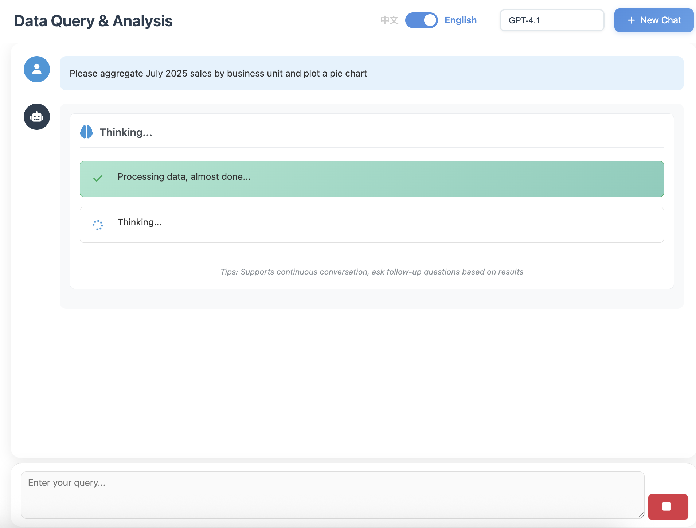
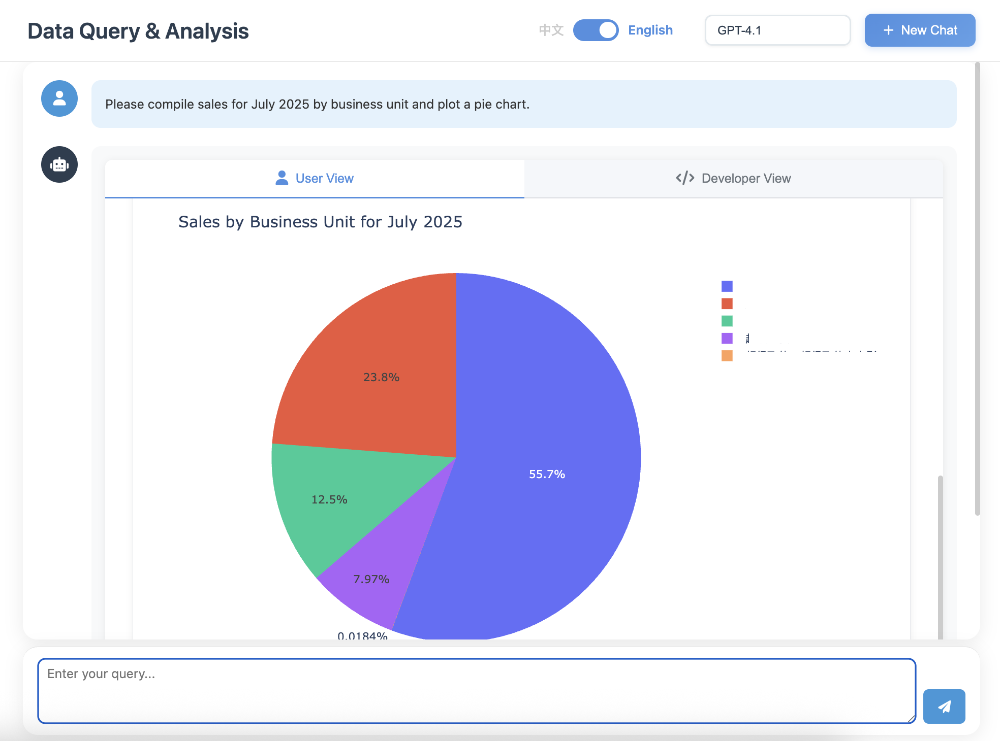

<div align="center">
  
  
  
  <br/>
  
  <p>
    <a href="../README.md">English</a> •
    <a href="README_CN.md">简体中文</a> •
    <a href="#">Deutsch</a>
  </p>
  
  <br/>
  
  [](LICENSE)
  [](https://www.python.org/)
  [](https://github.com/OpenInterpreter/open-interpreter)
  [](https://github.com/MKY508/QueryGPT/stargazers)
  
  <br/>
  
  <h3>Ein intelligenter Datenanalyse-Agent basierend auf OpenInterpreter</h3>
  <p><i>Kommunizieren Sie mit Ihrer Datenbank in natürlicher Sprache</i></p>
  
</div>

## ✨ Kernvorteile

**Denkt wie ein Datenanalyst**
- **Autonome Exploration**: Untersucht proaktiv Tabellenstrukturen und Beispieldaten bei Problemen
- **Mehrfache Validierung**: Überprüft erneut bei Anomalien, um genaue Ergebnisse sicherzustellen
- **Komplexe Analyse**: Nicht nur SQL, kann Python für statistische Analysen und maschinelles Lernen ausführen
- **Sichtbares Denken**: Echtzeit-Anzeige des Reasoning-Prozesses des Agents (Chain-of-Thought)

## 📸 System-Screenshots



**Echtzeit-Anzeige des KI-Denkprozesses, komplexe Datenanalyse durch Gespräche auf Deutsch.**

---



**Automatische Generierung interaktiver Diagramme, Dateninsights auf einen Blick.**

---


**Vollständig transparente Code-Ausführung, unterstützt SQL und Python als Doppel-Engine.**

## 🌟 Funktionen

### Agent-Kernfähigkeiten
- **Autonome Datenexploration**: Agent versteht proaktiv Datenstrukturen und erkundet Datenbeziehungen
- **Mehrfaches Reasoning**: Wie ein Analyst, untersucht Probleme tiefgründig
- **Chain-of-Thought**: Echtzeit-Anzeige des Agent-Denkprozesses, kann jederzeit eingreifen und korrigieren
- **Kontextgedächtnis**: Versteht Gesprächsverlauf, unterstützt kontinuierliche mehrfache Analysen

### Datenanalysefähigkeiten
- **SQL + Python**: Nicht auf SQL beschränkt, kann komplexe Python-Datenverarbeitung ausführen
- **Statistische Analyse**: Automatische Korrelationsanalyse, Trendvorhersage, Anomalieerkennung
- **Geschäftsterminologie**: Natives Verständnis von Konzepten wie MoM, YoY, Retention, Repurchase
- **Intelligente Visualisierung**: Wählt automatisch den besten Diagrammtyp basierend auf Datenmerkmalen

### Systemfunktionen
- **Multi-Modell-Unterstützung**: GPT-5, Claude, Gemini, Ollama lokale Modelle frei wechseln
- **Flexible Bereitstellung**: Unterstützt Cloud-API oder Ollama lokale Bereitstellung, Daten verlassen nie das Haus
- **Verlaufsaufzeichnung**: Speichert Analyseprozesse, unterstützt Rückverfolgung und Freigabe
- **Datensicherheit**: Nur-Lese-Berechtigungen, SQL-Injection-Schutz, sensible Datenmaskierung
- **Flexible Exporte**: Unterstützt Excel, PDF, HTML und andere Formate

## 📦 Technische Anforderungen

- Python 3.10.x (erforderlich, OpenInterpreter 0.4.3 Abhängigkeit)
- MySQL oder kompatible Datenbank

> Windows: Bitte in WSL ausführen (führen Sie Skripte nicht direkt in PowerShell/CMD aus).

## 📊 Produktvergleich

| Vergleichsdimension | **QueryGPT** | Vanna AI | DB-GPT | TableGPT | Text2SQL.AI |
|---------------------|:------------:|:--------:|:------:|:--------:|:-----------:|
| **Kosten** | **✅ Kostenlos** | ⭕ Hat kostenpflichtige Version | ✅ Kostenlos | ❌ Kostenpflichtig | ❌ Kostenpflichtig |
| **Open Source** | **✅** | ✅ | ✅ | ❌ | ❌ |
| **Lokale Bereitstellung** | **✅** | ✅ | ✅ | ❌ | ❌ |
| **Python-Code ausführen** | **✅ Vollständige Umgebung** | ❌ | ❌ | ❌ | ❌ |
| **Visualisierungsfähigkeit** | **✅ Programmierbar** | ⭕ Voreingestellte Diagramme | ✅ Reiche Diagramme | ✅ Reiche Diagramme | ⭕ Basis |
| **Geschäftsterminologie-Verständnis** | **✅ Native** | ⭕ Basis | ✅ Gut | ✅ Ausgezeichnet | ⭕ Basis |
| **Agent autonome Exploration** | **✅** | ❌ | ⭕ Basis | ⭕ Basis | ❌ |
| **Echtzeit-Denkanzeige** | **✅** | ❌ | ❌ | ❌ | ❌ |
| **Erweiterungsfähigkeit** | **✅ Unbegrenzte Erweiterung** | ❌ | ❌ | ❌ | ❌ |

### Unsere Kernunterschiede
- **Vollständige Python-Umgebung**: Keine voreingestellten Funktionen, sondern eine echte Python-Ausführungsumgebung, in der Sie jeden Code schreiben können
- **Unbegrenzte Erweiterbarkeit**: Benötigen Sie neue Funktionen? Installieren Sie einfach neue Bibliotheken, müssen nicht auf Produkt-Updates warten
- **Agent autonome Exploration**: Untersucht proaktiv bei Problemen, nicht nur einfache einmalige Abfragen
- **Transparenter Denkprozess**: Sehen Sie in Echtzeit, was die KI denkt, können jederzeit eingreifen und leiten
- **Wirklich kostenlos und Open Source**: MIT-Lizenz, keine Paywall

## 🚀 Schnellstart

### Erste Verwendung

```bash
# 1. Projekt klonen
git clone https://github.com/MKY508/QueryGPT.git
cd QueryGPT

# 2. Installationsskript ausführen (konfiguriert automatisch die Umgebung)
./setup.sh

# 3. Service starten
./start.sh
```

### Spätere Verwendung

```bash
# Direkt starten (Umgebung bereits installiert)
./start.sh
```

Der Service läuft standardmäßig auf http://localhost:5000

> **Hinweis**: Wenn Port 5000 belegt ist (z.B. macOS AirPlay), wählt das System automatisch den nächsten verfügbaren Port (5001-5010) und zeigt beim Start den tatsächlich verwendeten Port an.

## ⚙️ Konfigurationsanleitung

### Grundkonfiguration

1. **Umgebungskonfigurationsdatei kopieren**
   ```bash
   cp .env.example .env
   ```

2. **Bearbeiten Sie die .env-Datei und konfigurieren Sie Folgendes**
   - `OPENAI_API_KEY`: Ihr OpenAI API-Schlüssel
   - `OPENAI_BASE_URL`: API-Endpunkt (optional, verwendet standardmäßig den offiziellen Endpunkt)
   - Datenbankverbindungsinformationen

### Semantische Schichtkonfiguration (Optional)

Die semantische Schicht verbessert das Verständnis von Geschäftsterminologie und hilft dem System, Ihre Geschäftssprache besser zu verstehen. **Dies ist eine optionale Konfiguration, die Nicht-Konfiguration beeinträchtigt nicht die Grundfunktionen.**

1. **Beispieldatei kopieren**
   ```bash
   cp backend/semantic_layer.json.example backend/semantic_layer.json
   ```

2. **Konfiguration entsprechend Ihren Geschäftsanforderungen ändern**
   
   Die semantische Schichtkonfiguration enthält drei Teile:
   - **Datenbankzuordnung**: Definiert die Geschäftsbedeutung der Datenbank
   - **Kern-Geschäftstabellen**: Ordnet wichtige Geschäftstabellen und -felder zu
   - **Schnellsuchindex**: Schnellsuche für gängige Begriffe

3. **Konfigurationsbeispiel**
   ```json
   {
     "Kern-Geschäftstabellen": {
       "Bestellverwaltung": {
         "Tabellenpfad": "database.orders",
         "Schlüsselwörter": ["Bestellung", "Verkauf", "Transaktion"],
         "Erforderliche Felder": {
           "order_id": "Bestellnummer",
           "amount": "Betrag"
         }
       }
     }
   }
   ```

> **Hinweis**: 
> - Die semantische Schichtdatei enthält geschäftssensible Informationen und wurde zu `.gitignore` hinzugefügt, wird nicht zur Versionskontrolle übermittelt
> - Wenn die semantische Schicht nicht konfiguriert ist, verwendet das System die Standardkonfiguration und kann weiterhin normal Datenabfragen durchführen
> - Für detaillierte Konfigurationsanweisungen siehe [backend/SEMANTIC_LAYER_SETUP.md](backend/SEMANTIC_LAYER_SETUP.md)

## 📁 Projektstruktur

```
QueryGPT/
├── backend/              # Backend-Service
│   ├── app.py           # Flask-Anwendungshaupteinstieg
│   ├── database.py      # Datenbankverbindungsverwaltung
│   ├── interpreter_manager.py  # Abfrage-Interpreter
│   ├── history_manager.py      # Verlaufsverwaltung
│   └── config_loader.py        # Konfigurationslader
├── frontend/            # Frontend-Interface
│   ├── templates/       # HTML-Vorlagen
│   └── static/          # Statische Ressourcen
│       ├── css/         # Styling-Dateien
│       └── js/          # JavaScript
├── docs/                # Projektdokumentation
├── logs/                # Protokolldirectory
├── output/              # Ausgabedateien
├── requirements.txt     # Python-Abhängigkeiten
└── .env.example         # Konfigurationsbeispiel
```

## 🔌 API-Schnittstellen

### Abfrage-Schnittstelle

```http
POST /api/chat
Content-Type: application/json

{
  "message": "Gesamtumsatz dieses Monats abfragen",
  "model": "default"
}
```

### Verlauf

```http
GET /api/history/conversations    # Verlaufsliste abrufen
GET /api/history/conversation/:id # Details abrufen
DELETE /api/history/conversation/:id # Datensatz löschen
```

### Gesundheitsprüfung

```http
GET /api/health
```

## 🔒 Sicherheitshinweise

- Unterstützt nur schreibgeschützte Abfragen (SELECT, SHOW, DESCRIBE)
- Filtert automatisch gefährliche SQL-Anweisungen
- Datenbankbenutzer sollten mit schreibgeschützten Berechtigungen konfiguriert werden

## 📄 Lizenz

MIT License - Siehe [LICENSE](LICENSE) Datei für Details

## 🆕 Neueste Updates

- 2025-09-05 – Startgeschwindigkeitsoptimierung: Entfernt automatischen Batch-Test beim ersten Betreten der Modellseite, reduziert unnötige Anfragen und vermeidet falsche Status-Schreibvorgänge.

## 👨‍💻 Autor

- **Autor**: Mao Kaiyue
- **GitHub**: [@MKY508](https://github.com/MKY508)
- **Erstellungsdatum**: August 2025

## ⭐ Star History

<div align="center">
  <a href="https://star-history.com/#MKY508/QueryGPT&Date">
    <picture>
      <source media="(prefers-color-scheme: dark)" srcset="https://api.star-history.com/svg?repos=MKY508/QueryGPT&type=Date&theme=dark" />
      <source media="(prefers-color-scheme: light)" srcset="https://api.star-history.com/svg?repos=MKY508/QueryGPT&type=Date" />
      
    </picture>
  </a>
</div>

## 🤝 Beitragen

Willkommen zum Einreichen von Issues und Pull Requests.

1. Forken Sie dieses Projekt
2. Erstellen Sie einen Feature-Branch (`git checkout -b feature/AmazingFeature`)
3. Committen Sie Ihre Änderungen (`git commit -m 'Add some AmazingFeature'`)
4. Pushen Sie zum Branch (`git push origin feature/AmazingFeature`)
5. Öffnen Sie einen Pull Request
