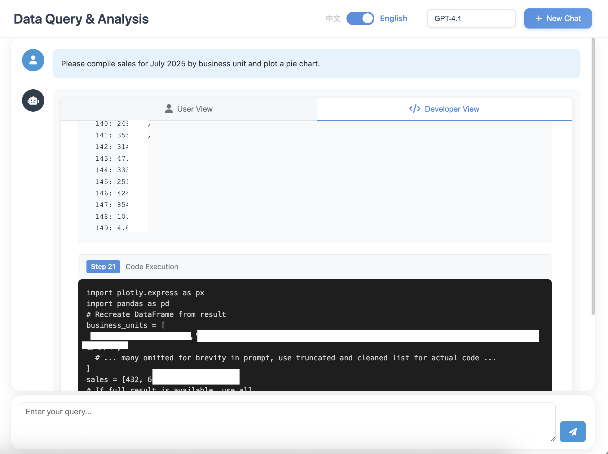

<div align="center">
  
  
  
  <br/>
  
  <p>
    <a href="README.md">English</a> •
    <a href="docs/README_CN.md">简体中文</a> •
    <a href="#">繁體中文</a>
  </p>
  
  <br/>
  
  [](LICENSE)
  [](https://www.python.org/)
  [](https://github.com/OpenInterpreter/open-interpreter)
  [](https://github.com/MKY508/QueryGPT/stargazers)
  
  <br/>
  
  <h3>基於 OpenInterpreter 的智慧數據分析 Agent</h3>
  <p><i>用自然語言與資料庫對話</i></p>
  
</div>

## ✨ 核心優勢

**像數據分析師一樣思考**
- **自主探索**：遇到問題會主動查看表結構、樣本數據
- **多輪驗證**：發現異常會重新檢查，確保結果準確
- **複雜分析**：不只是 SQL，能執行 Python 做統計分析、機器學習
- **思考可見**：即時展示 Agent 的推理過程（Chain-of-Thought）

## 📸 系統截圖


**即時展示 AI 思考過程，中文對話即可完成複雜數據分析。**

---


**自動生成互動式圖表，數據洞察一目了然。**

---



**完全透明的代碼執行，支援 SQL 與 Python 雙引擎。**

## 🌟 功能特性

### Agent 核心能力
- **自主數據探索**：主動理解數據結構、探索數據關係
- **多輪推理迭代**：像分析師一樣深入調查
- **Chain-of-Thought**：即時展示 AI 思考過程，可隨時介入
- **上下文記憶**：理解對話歷史，支援連續分析

### 數據分析能力
- **SQL + Python**：不局限於 SQL，支援複雜的 Python 數據處理
- **統計分析**：自動進行相關性分析、趨勢預測、異常檢測
- **業務術語理解**：原生理解年增率、月增率、留存率、復購率等
- **智慧可視化**：自動選擇最佳圖表類型

### 系統特性
- **多模型支援**：GPT-5、Claude、Gemini、Ollama 等
- **彈性部署**：支援雲端 API 或本地部署，數據不外流
- **歷史記錄**：保存分析過程，支援回溯與分享
- **數據安全**：唯讀權限、SQL 注入防護、敏感數據遮罩
- **彈性匯出**：支援 Excel、PDF、HTML 等

## 📦 技術要求

- Python 3.10.x（必需，OpenInterpreter 0.4.3 依賴）
- MySQL 或相容資料庫

> Windows：請在 WSL 中執行（請勿在 PowerShell/CMD 直接執行腳本）。

## 📊 產品對比

| 對比維度 | **QueryGPT** | Vanna AI | DB-GPT | TableGPT | Text2SQL.AI |
|---------|:------------:|:--------:|:------:|:--------:|:-----------:|
| **費用** | **✅ 免費** | ⭕ 付費版 | ✅ 免費 | ❌ 收費 | ❌ 收費 |
| **開源** | **✅** | ✅ | ✅ | ❌ | ❌ |
| **本地部署** | **✅** | ✅ | ✅ | ❌ | ❌ |
| **Python 執行** | **✅ 完整環境** | ❌ | ❌ | ❌ | ❌ |
| **可視化能力** | **✅ 可編程** | ⭕ 預設圖表 | ✅ 豐富圖表 | ✅ 豐富圖表 | ⭕ 基本 |
| **業務理解** | **✅ 原生** | ⭕ 基本 | ✅ 良好 | ✅ 優秀 | ⭕ 基本 |
| **Agent 自主探索** | **✅** | ❌ | ⭕ 基本 | ⭕ 基本 | ❌ |
| **即時思考展示** | **✅** | ❌ | ❌ | ❌ | ❌ |
| **擴展能力** | **✅ 無限擴展** | ❌ | ❌ | ❌ | ❌ |

### 我們的核心差異
- **完整 Python 環境**：真正的 Python 執行環境，可自由撰寫任何代碼
- **無限擴展性**：需要新功能？直接安裝新庫即可
- **Agent 自主探索**：遇到問題會主動調查，不是單次查詢
- **思考過程透明**：可即時查看 AI 的思考並介入
- **真正免費開源**：MIT 授權，無任何付費牆

## 🚀 快速開始

### 首次使用

```bash
# 1. 複製專案
git clone https://github.com/MKY508/QueryGPT.git
cd QueryGPT

# 2. 執行安裝腳本（自動配置環境）
./setup.sh

# 3. 啟動服務
./start.sh
```

### 後續使用

```bash
# 已安裝環境下快速啟動
./start.sh
```

服務預設運行於 http://localhost:5000

> **注意**：若 5000 埠被占用（如 macOS AirPlay），系統會自動選擇 5001–5010 可用埠並在啟動時顯示。

## ⚙️ 配置說明

### 基礎配置

1. **複製環境設定檔**
   ```bash
   cp .env.example .env
   ```
2. **編輯 .env 設定以下內容**
   - `OPENAI_API_KEY`：OpenAI API 金鑰
   - `OPENAI_BASE_URL`：API 端點（可選）
   - 資料庫連線資訊

### 語義層配置（選用）

**用於增強業務術語理解，不配置不影響基礎功能。**

1. **複製範本**
   ```bash
   cp backend/semantic_layer.json.example backend/semantic_layer.json
   ```
2. **依需求修改**（資料庫映射／核心業務表／快速索引）

## 📁 專案結構

```
QueryGPT/
├── backend/
│   ├── app.py
│   ├── database.py
│   ├── interpreter_manager.py
│   ├── history_manager.py
│   └── config_loader.py
├── frontend/
│   ├── templates/
│   └── static/
│       ├── css/
│       └── js/
├── docs/
├── logs/
├── output/
├── requirements.txt
└── .env.example
```

## 🔌 API 介面

### 查詢介面

```http
POST /api/chat
Content-Type: application/json

{
  "message": "查詢本月銷售總額",
  "model": "default"
}
```

### 歷史記錄

```http
GET /api/history/conversations
GET /api/history/conversation/:id
DELETE /api/history/conversation/:id
```

### 健康檢查

```http
GET /api/health
```

## 🔒 安全說明

- 僅支援唯讀查詢（SELECT, SHOW, DESCRIBE）
- 自動過濾危險 SQL 語句
- 建議將資料庫用戶配置為唯讀

## 📄 授權條款

MIT License - 詳見 [LICENSE](LICENSE)

## 🆕 最新更新

- 2025-09-05 – 啟動速度優化：移除首次進入模型頁的自動批量測試，減少不必要請求並避免狀態誤寫。

## 👨‍💻 作者資訊

- **作者**：Mao Kaiyue
- **GitHub**：[@MKY508](https://github.com/MKY508)
- **建立時間**：2025年8月

## ⭐ Star History

<div align="center">
  <a href="https://star-history.com/#MKY508/QueryGPT&Date">
    <picture>
      <source media="(prefers-color-scheme: dark)" srcset="https://api.star-history.com/svg?repos=MKY508/QueryGPT&type=Date&theme=dark" />
      <source media="(prefers-color-scheme: light)" srcset="https://api.star-history.com/svg?repos=MKY508/QueryGPT&type=Date" />
      
    </picture>
  </a>
</div>

## 🤝 貢獻

歡迎提交 Issue 與 Pull Request。

1. Fork 本專案
2. 建立功能分支 (`git checkout -b feature/AmazingFeature`)
3. 提交變更 (`git commit -m 'Add some AmazingFeature'`)
4. 推送分支 (`git push origin feature/AmazingFeature`)
5. 建立 Pull Request
