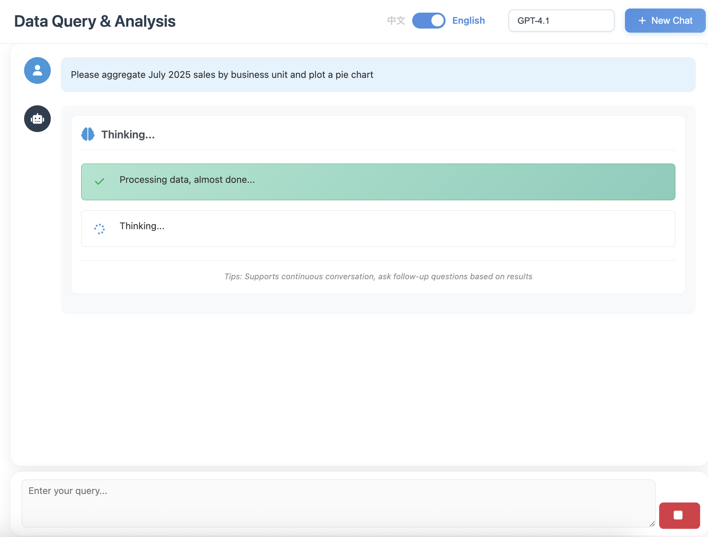
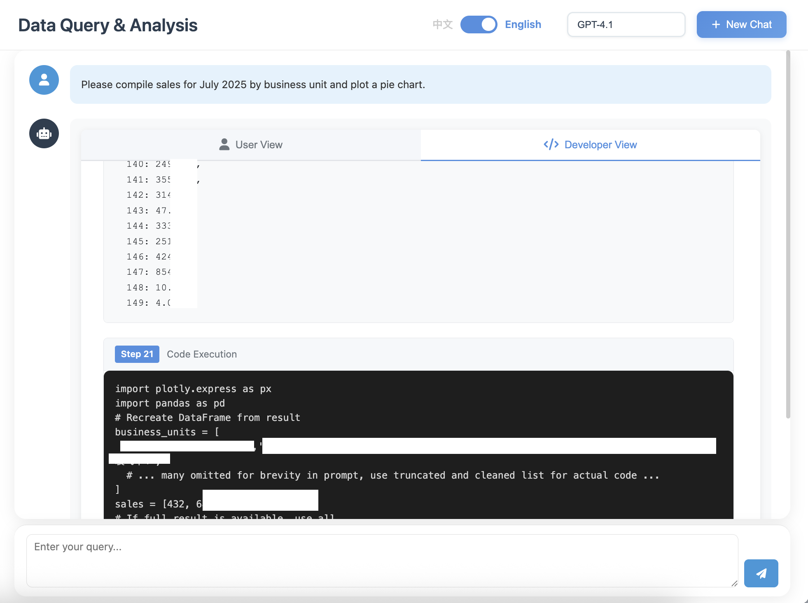

<div align="center">
  
  
  
  <br/>
  
  <p>
    <a href="../README.md">简体中文</a> •
    <a href="#">English</a> •
    <a href="README/README_ZH-TW.md">繁體中文</a> •
    <a href="README/README_JA.md">日本語</a> •
    <a href="README/README_ES.md">Español</a> •
    <a href="README/README_FR.md">Français</a> •
    <a href="README_DE.md">Deutsch</a> •
    <a href="README/README_RU.md">Русский</a> •
    <a href="README/README_PT.md">Português</a> •
    <a href="README/README_KO.md">한국어</a>
  </p>
  
  <br/>
  
  [](../LICENSE)
  [](https://www.python.org/)
  [](https://github.com/OpenInterpreter/open-interpreter)
  [](https://github.com/MKY508/QueryGPT/stargazers)
  
  <br/>
  
  <h3>An intelligent data analysis Agent based on OpenInterpreter</h3>
  <p><i>Chat with your database in natural language</i></p>
  
</div>

<br/>

---

## ✨ Core Advantages

**Think Like a Data Analyst**
- **Autonomous Exploration**: Proactively examines table structures and sample data when encountering issues
- **Multi-round Validation**: Re-checks when anomalies are found to ensure accurate results
- **Complex Analysis**: Not just SQL, can execute Python for statistical analysis and machine learning
- **Visible Thinking**: Real-time display of Agent's reasoning process (Chain-of-Thought)

## 📸 System Screenshots

<table>
  <tr>
    <td align="center">
      
      <b>Real-time AI Thinking Process</b>
    </td>
  </tr>
  <tr>
    <td align="center">
      
      <b>Interactive Data Visualization</b>
    </td>
  </tr>
  <tr>
    <td align="center">
      
      <b>Transparent Code Execution</b>
    </td>
  </tr>
</table>

## 🌟 Key Features

### Intelligent Routing System 🆕
- **AI Query Classification**: Uses LLM to determine query intent and automatically select the optimal path
- **Three Execution Modes**:
  - `QA`: Polite reply for chit-chat or unsupported topics
  - `ANALYSIS`: Unified data retrieval & analysis pipeline (Python, visualization, reporting)
- **Safety Fallback**: Clear warnings when the database is unavailable or routing fails, with user-controlled continuation
- **Flexible Configuration**: Each mode has independent prompts editable via the UI for business-specific tuning
- **Database Guard**: Lightweight connectivity check before execution, surfaces friendly warnings and lets the user decide whether to continue
- **Step Narration**: Configurable `Step {index}: {summary}` instructions keep every action transparent across QA/SQL/Analysis modes

### Agent Core Capabilities
- **Autonomous Data Exploration**: Agent proactively understands data structure and explores relationships
- **Multi-round Reasoning**: Like an analyst, investigates deeply when issues arise
- **Chain-of-Thought**: Real-time display of Agent's thinking process, intervention possible anytime
- **Context Memory**: Understands conversation history, supports continuous multi-round analysis

### Data Analysis Capabilities
- **SQL + Python**: Not limited to SQL, can execute complex Python data processing
- **Statistical Analysis**: Automatic correlation analysis, trend prediction, anomaly detection
- **Chinese Business Terms**: Native understanding of YoY, MoM, retention, repurchase concepts
- **Smart Visualization**: Automatically selects best chart type based on data characteristics

### System Features
- **Intelligent Routing System**: 🆕 AI automatically determines query type and selects optimal execution path (Beta)
- **Onboarding System**: 🆕 Interactive bubble tips to help new users get started quickly
- **Multi-model Support**: Switch freely between GPT-5, Claude, Gemini, Ollama local models
- **Flexible Deployment**: Supports cloud API or Ollama local deployment, data never leaves premises
- **History Records**: Saves analysis process, supports backtracking and sharing
- **Data Security**: Read-only permissions, SQL injection protection, sensitive data masking
- **Flexible Export**: Supports Excel, PDF, HTML and other formats
- **Custom Prompts**: Frontend visual editing of query prompts, supports import/export configuration

## 📦 Environment Requirements

- Python 3.10.x (Required, OpenInterpreter 0.4.3 dependency)
- MySQL protocol compatible database (see support list below)
- Supported systems: Linux, macOS, **Windows (must use WSL)**

> ⚠️ **Important notice for Windows users**: This project uses bash scripts and **must run in WSL (Windows Subsystem for Linux)**, not supported in PowerShell or CMD.

<br/>

## 📊 Product Comparison

| Comparison | **QueryGPT** | Vanna AI | DB-GPT | TableGPT | Text2SQL.AI |
|------------|:------------:|:--------:|:------:|:--------:|:-----------:|
| **Cost** | **✅ Free** | ⭕ Has paid version | ✅ Free | ❌ Paid | ❌ Paid |
| **Open Source** | **✅** | ✅ | ✅ | ❌ | ❌ |
| **Local Deployment** | **✅** | ✅ | ✅ | ❌ | ❌ |
| **Execute Python Code** | **✅ Full environment** | ❌ | ❌ | ❌ | ❌ |
| **Visualization** | **✅ Programmable** | ⭕ Preset charts | ✅ Rich charts | ✅ Rich charts | ⭕ Basic |
| **Chinese Business Understanding** | **✅ Native** | ⭕ Basic | ✅ Good | ✅ Excellent | ⭕ Basic |
| **Agent Autonomous Exploration** | **✅** | ❌ | ⭕ Basic | ⭕ Basic | ❌ |
| **Real-time Thinking Display** | **✅** | ❌ | ❌ | ❌ | ❌ |
| **Extensibility** | **✅ Unlimited** | ❌ | ❌ | ❌ | ❌ |

### Our Core Differences
- **Complete Python Environment**: Not preset features, but a real Python execution environment where you can write any code
- **Unlimited Extensibility**: Need new features? Just install new libraries, no need to wait for product updates
- **Agent Autonomous Exploration**: Proactively investigates when encountering issues, not just simple one-time queries
- **Transparent Thinking Process**: See what AI is thinking in real-time, can intervene and guide anytime
- **Truly Free and Open Source**: MIT license, no paywalls

## 🚀 Quick Start

### 🖥️ Windows / WSL Tips

- Only supported in WSL Linux environment; do not execute scripts in PowerShell/CMD.
- If WSL not installed: Run `wsl --install` in Administrator PowerShell, restart and open "Ubuntu".
- For detailed steps, see "Simple Installation → Windows WSL Users" below.

### Simple Installation

#### 🍎 macOS / Linux Users
```bash
# 1. Clone project
git clone https://github.com/MKY508/QueryGPT.git
cd QueryGPT

# 2. Run scripts
./setup.sh   # Auto-install all dependencies (2-5 minutes)
./start.sh   # Start services
```

That's it! ✨

#### 🪟 Windows WSL Users
```bash
# Step 1: Enter WSL (in PowerShell)
wsl

# Step 2: Clone project (in WSL)
cd ~
git clone https://github.com/MKY508/QueryGPT.git
cd QueryGPT

# Step 3: Run scripts (in WSL)
./setup.sh   # Auto-handle all dependencies
./start.sh   # Start services
```

> **Performance optimization**: WSL scripts auto-detect and migrate from Windows filesystem (/mnt/) to Linux filesystem (~/), improving performance by 10x

### Access Service
Open browser and visit: `http://localhost:5000`

## 💡 Usage Examples

### Basic Queries
- "Show sales data for the last month"
- "Analyze sales distribution by product category"
- "Find top 10 customers by sales amount"

### Advanced Analysis
- "Compare this year's sales growth with the same period last year"
- "Predict next quarter's sales trend"
- "Find anomalous order data"
- "Analyze customer purchasing behavior patterns"

### Complex Tasks
- "Generate monthly sales report with MoM, YoY and trend charts"
- "Analyze customer churn reasons and provide recommendations"
- "Build RFM customer segmentation model"

## 🔧 Configuration

### Supported Models
- **OpenAI**: GPT-5, GPT-4.1 (economical)
- **Anthropic**: Claude 4 Opus, Sonnet (highest rated, most intelligent, frequent tool use)
- **Google**: Gemini 2.5 Pro (may have litellm compatibility issues)
- **Domestic Models**: Qwen, DeepSeek, GLM-4, Baichuan, etc.
- **Local Models**: via Ollama - Llama, Mistral, Qwen etc. (recommended qwen2.5 7b+, ensure code capability)
- **Recommended**: Claude 4 series, GPT-4, DeepSeek V3 and other powerful foundation models to ensure Agent execution success rate

### Database Support

The system uses standard MySQL protocol and supports the following databases:

#### ✅ Fully Compatible
- **Apache Doris** / **StarRocks** - OLAP analytical databases (recommended for big data analysis)
- **MySQL 5.7+** / **MariaDB 10.3+** - Traditional relational databases
- **TiDB** - Distributed NewSQL database
- **OceanBase** - Distributed database (MySQL mode)
- **PolarDB** - Alibaba Cloud-native database

#### ⚠️ Notes
- This system uses **read-only queries** (SELECT, SHOW, DESCRIBE)
- Does not depend on stored procedures, triggers, foreign keys and other features
- Supports cross-database queries (leave database name empty in configuration)

#### 🔧 Connection Configuration
```bash
# .env configuration example
DB_HOST=localhost
DB_PORT=9030      # Doris/StarRocks: 9030, MySQL: 3306, TiDB: 4000
DB_USER=root
DB_PASSWORD=your_password
DB_NAME=          # Leave empty for cross-database query support
```

## 📚 Documentation

- [Full Documentation](.)
- [API Documentation](API.md)
- [Deployment Guide](DEPLOYMENT.md)
- [FAQ](FAQ.md)
- [Configuration Guide](CONFIGURATION.md)

## 🔧 Quick Troubleshooting

### Windows/WSL Common Issues

| Problem | Solution |
|---------|----------|
| **bash: ./setup.sh: No such file or directory** | You're in PowerShell, please enter `wsl` first to enter WSL environment |
| **'.' is not recognized as an internal or external command** | Same as above, must run in WSL, not CMD/PowerShell |
| **Permission denied** | Run `chmod +x setup.sh start.sh` to add execute permissions |
| **Process stops immediately in WSL** | Script auto-handles this, uses foreground mode |
| **python3: command not found** | Run `sudo apt update && sudo apt install python3` in WSL |

### Linux/Ubuntu Common Issues

| Problem | Solution |
|---------|----------|
| **No module named 'venv'** | Run `sudo apt install python3-venv` or use v1.5 setup.sh for auto-fix |
| **pip install timeout** | Auto-configured domestic mirror sources (Alibaba/Tsinghua/USTC) |
| **virtualenv: command not found** | Run `pip install virtualenv` |

### General Issues

| Problem | Solution |
|---------|----------|
| **Port occupied** | Auto-scan ports 5000-5100 to find available port |
| **backend directory not found** | Run `cd ~/QueryGPT-github && ./start.sh` |
| **Virtual environment doesn't exist** | Run `./setup.sh` to reinstall |
| **Environment detection issues** | Run `./diagnostic.sh` for detailed environment info |

## 🤝 Contributing

Issues and Pull Requests are welcome!

## 📄 License

MIT License - see [LICENSE](../LICENSE) for details

## Latest Updates

### 2025-11-04 - v1.5 Intelligent Routing & UX Overhaul
- **Simplified Routing**: Removed SQL_ONLY path, unified into QA (polite decline) and ANALYSIS (data analysis)
- **Prompt Overhaul**:
  - Rebuilt ANALYSIS system prompts with five-stage workflow (connect → explore → table selection → data processing → output)
  - Injected executable pymysql examples, preventing raw SQL or local file access
  - Synced frontend settings, prompt_config.json, setup.sh to ensure consistent defaults
- **Database Guard Enhancements**:
  - Reused thinking bubble for connection warnings, no extra chat messages
  - Added dynamic 8→0 countdown with cleanup on continue/configure
  - Improved warning card details (target, timestamp, suggested next steps)
- **Thought Stream Visualization**:
  - Backend extracts `[步骤 x]` logs, frontend streams them step-by-step like ChatGPT
  - User view auto-cleans step prefixes; developer view keeps full log
  - Removed redundant "thinking" placeholder—now starts at “Understanding request” then real steps
- **Settings Page Fixes**: Restored tab switching for Models/Database/Prompt panels

### 2025-09-05 - v1.2 Official Release
- **Smart Virtual Environment Creation**: Resolved Ubuntu/Debian missing python3-venv issue
- **Three-tier Fallback Mechanism**: venv → auto-install python3-venv → virtualenv backup
- **Windows WSL Documentation**: Enhanced README with clear WSL requirement explanation
- **Environment Detection Optimization**: Fixed macOS and pure Linux environment detection issues
- **New Diagnostic Tools**: Added diagnostic.sh for environment troubleshooting
- **Deep Code Cleanup**: Removed 45KB unused code, improved project maintainability
- **Startup Speed Optimization**: Removed auto-batch testing on first model page visit, reducing unnecessary requests and avoiding state corruption, shortening initial load time

### 2025-09-03 - Perfect Windows WSL Support
- **WSL Auto-optimization**: Auto-detect WSL environment and migrate to Linux filesystem, 10x performance boost
- **Smart Path Handling**: Auto-handle differences between Windows paths (/mnt/*) and Linux paths (~/)
- **Process Management Fix**: Solved WSL background process immediate stop issue, using foreground mode
- **Network Issue Resolution**: Auto-configure domestic mirror sources (Alibaba/Tsinghua/USTC), solve pip timeout
- **Minimal Scripts**: Simplified to only setup.sh and start.sh, auto-handle all environment differences
- **Zero-config Experience**: WSL users need no additional configuration, auto-detect and optimize

### 2025-08-28 - v1.1 System Optimization Upgrade
- **Enhanced Intelligent Routing**: Optimized query classification logic, simple queries direct SQL execution, complex analysis full feature support
- **Process Management Fix**: Resolved stop button click continuing background processes, complete process tree management
- **Onboarding Optimization**: Fixed repeated guidance display, added version control and session check mechanism
- **Prompt Customization**: Support different routing modes using independent system prompts, optimized query effects
- **Configuration Service**: Added configuration file routing support, fixed frontend-backend configuration mapping inconsistency

### 2025-08-28 - Onboarding System
- **Interactive Guidance**: First visit auto-shows system features, bubble tips guide operations
- **Smart Positioning**: Auto-detect element positions, ensure bubbles accurately point to targets
- **Flexible Configuration**: Control guidance behavior through config files, easily disable
- **Progress Tracking**: Display guidance progress, support forward, backward, skip operations
- **User-friendly**: History optimization, removed redundant model display, fixed conversation counting

> Configuration file: `config/onboarding_config.json` - Set `enabled: false` to disable guidance

### 2025-08-25 - AI Intelligent Routing System Launch (Beta)
- **Smart Classification**: AI auto-identifies query types (direct SQL, simple analysis, complex analysis, visualization)
- **Performance Optimization**: Simple queries direct SQL execution, 80%+ response speed improvement
- **Independent Configuration**: Each routing type equipped with dedicated Prompt, precise behavior control
- **Flexible Control**: One-click enable/disable intelligent routing in basic settings
- **Complete Monitoring**: Real-time routing distribution statistics, optimize system performance

> Enter `Settings` → `Basic Settings` → `Intelligent Routing` to enable Beta feature!

### 2025-08-24 - Custom Prompt Feature
- **Visual Editing**: Directly edit AI query prompts in settings page
- **Configuration Management**: Support save, restore defaults, import/export configuration
- **Flexible Customization**: Adjust exploration strategies, table selection rules, field mapping based on business needs
- **Multi-language Support**: Complete Chinese-English i18n support
- **Real-time Effect**: Changes apply immediately to query process

## 🙏 Acknowledgments

- [OpenInterpreter](https://github.com/OpenInterpreter/open-interpreter) - Core AI engine
- [Flask](https://flask.palletsprojects.com/) - Web framework
- [Plotly](https://plotly.com/) - Data visualization

## 📧 Contact

- GitHub Issues: [Submit Issues](https://github.com/MKY508/QueryGPT/issues)
- Email: mky369258@gmail.com
- This is the author's first work. For any questions or possible improvements, feel free to submit issues or PRs, and I'll do my best to make adjustments

## ⭐ Star History

<div align="center">
  <a href="https://star-history.com/#MKY508/QueryGPT&Date">
    <picture>
      <source media="(prefers-color-scheme: dark)" srcset="https://api.star-history.com/svg?repos=MKY508/QueryGPT&type=Date&theme=dark" />
      <source media="(prefers-color-scheme: light)" srcset="https://api.star-history.com/svg?repos=MKY508/QueryGPT&type=Date" />
      
    </picture>
  </a>
</div>

---

<div align="center">
  <sub>If you find this useful, please give it a ⭐ Star!</sub>
</div>
